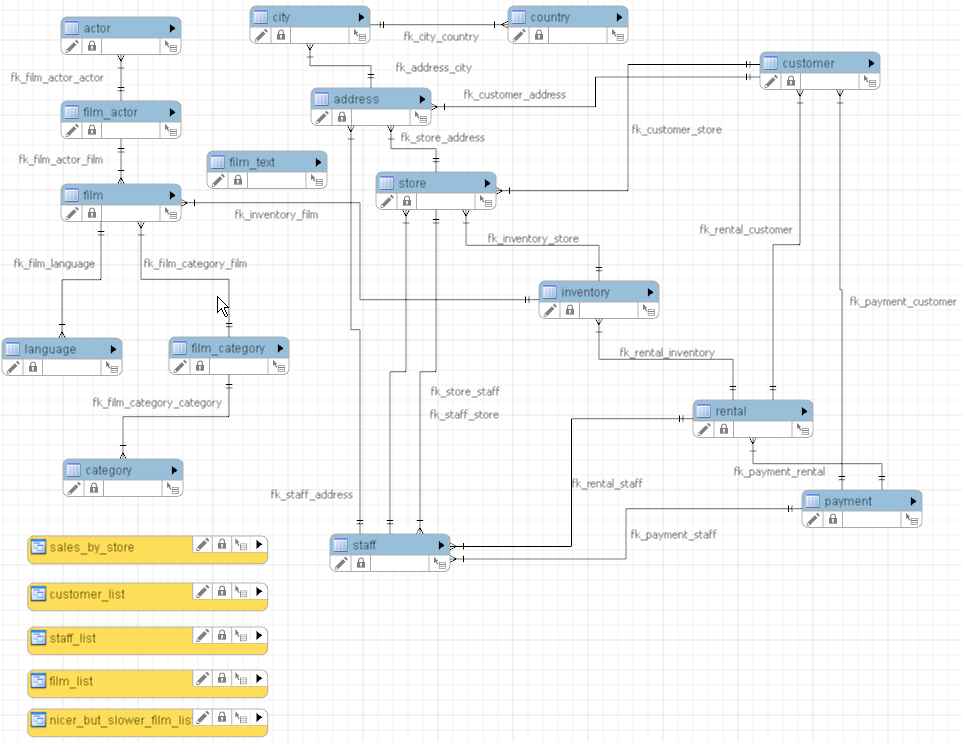

# Examen Databases Open Vragen

Datum: 17/06/2022

## Instructies

Lees deze instructies zeer zorgvuldig.

Beantwoord de vragen door een SQL query en output result in de respectievelijke velden sql en text in te vullen.

```sql
SELECT example FROM answer;
```

```text
+---------+
| example |
+---------+
|      42 |
+---------+
```

**Beperk het aantal rijen in het antwoord tot 15.**

**Geef enkel de gevraagde kolommen terug in alle queries.**

Tip het database ER diagram:



## Vragen

### Vraag 0

Onder de folder source vind je sakila-data.sql en sakila-schema.sql terug. Voer de scripts uit en toon alle data die in de *language* tabel terug te vinden is.

```sql
SOURCE sakila-schema.sql;
SOURCE sakila-data.sql;
SELECT * FROM language;
```

```text
+-------------+----------+---------------------+
| language_id | name     | last_update         |
+-------------+----------+---------------------+
|           1 | English  | 2006-02-15 05:02:19 |
|           2 | Italian  | 2006-02-15 05:02:19 |
|           3 | Japanese | 2006-02-15 05:02:19 |
|           4 | Mandarin | 2006-02-15 05:02:19 |
|           5 | French   | 2006-02-15 05:02:19 |
|           6 | German   | 2006-02-15 05:02:19 |
+-------------+----------+---------------------+
```

### Vraag 1

Maak 1 query voor:

1. Geef alle acteurs hun voornaam en familienaam terug waarvan hun familienaam begint met een 'W'.
1. De antwoorden dienen in 1 kolom genaamd 'Actor Name' teruggegeven te worden.
1. Allemaal in hoofdletters met een spatie tussen de voornaam en de familienaam.
1. Gesorteerd volgens familienaam en indien dezelfde familienaam ook nog gesorteerd volgens voornaam.

```sql
SELECT UPPER(CONCAT(first_name,' ', last_name)) AS 'Actor Name' 
FROM actor 
WHERE last_name LIKE 'W%'
ORDER BY last_name, first_name
LIMIT 15;
```

```text
+------------------+
| Actor Name       |
+------------------+
| DARYL WAHLBERG   |
| NICK WAHLBERG    |
| BELA WALKEN      |
| ALEC WAYNE       |
| CHRISTOPHER WEST |
| REESE WEST       |
| GROUCHO WILLIAMS |
| MORGAN WILLIAMS  |
| SEAN WILLIAMS    |
| BEN WILLIS       |
| GENE WILLIS      |
| HUMPHREY WILLIS  |
| WILL WILSON      |
| FAY WINSLET      |
| RIP WINSLET      |
+------------------+
```

### Vraag 2

Maak 1 query voor:

1. De naam van de acteur 'BURT TEMPLE' bevat een typo en heet 'BART TEMPLE', pas dit aan in de database.

```sql
UPDATE actor SET first_name = 'BART', last_name = 'TEMPLE' WHERE first_name = 'BURT' AND last_name = 'TEMPLE';
```

Geef het resultaat van de query ```SELECT * FROM actor WHERE last_name = 'TEMPLE';```:

```text
+----------+------------+-----------+---------------------+
| actor_id | first_name | last_name | last_update         |
+----------+------------+-----------+---------------------+
|       53 | MENA       | TEMPLE    | 2006-02-15 04:34:33 |
|      149 | RUSSELL    | TEMPLE    | 2006-02-15 04:34:33 |
|      193 | BART       | TEMPLE    | 2022-08-17 11:36:49 |
|      200 | THORA      | TEMPLE    | 2006-02-15 04:34:33 |
+----------+------------+-----------+---------------------+
```

### Vraag 3

Maak 1 query voor:

1. Geef de totale inkomsten (terug te vinden in de payment tabel) van mei 2005.
1. Geef het antwoord de naam 'Total income May 2005'.

```sql
SELECT SUM(amount) AS 'Total income May 2005' FROM payment 
WHERE Year(payment_date) = '2005' AND Month(payment_date) = '5'; 
```

```text
+-----------------------+
| Total income May 2005 |
+-----------------------+
|               4824.43 |
+-----------------------+
```

### Vraag 4

Geef het conceptuele ER diagram van de Sakila databank.


### Vraag 5

Maak 1 query:

1. Om te bepalen in hoeveel films de acteur 'Adam Grant' heeft meegespeeld.
1. Maak gebruik van subqueries.
1. Geef het antwoord de naam 'Number of films with Adam Grant'.

```sql
SELECT COUNT(*) AS 'Number of films with Adam Grant' FROM film_actor WHERE actor_id IN 
(SELECT actor_id FROM actor WHERE first_name = 'ADAM' AND last_name = 'GRANT'); 
```

```text
+----------------------------------+
| Number of films with Adam Grant |
+----------------------------------+
|                               18 |
+----------------------------------+
```

### Vraag 6

Maak 1 query:

1. Maak 1 query om een lijst van alle film titels uit de categorie 'New' weer te geven.
1. Maak gebruik van JOINS.
1. Beperk het aantal films in de output tot 15.
1. Sorteer het resultaat van Z -> A.

```sql
SELECT title FROM film 
INNER JOIN film_category ON film.film_id = film_category.film_id
INNER JOIN category ON film_category.category_id = category.category_id
WHERE category.name = 'New'
ORDER BY title DESC
LIMIT 15; 
```

```text
+--------------------+
| title              |
+--------------------+
| WYOMING STORM      |
| WILD APOLLO        |
| WAKE JAWS          |
| VOICE PEACH        |
| VARSITY TRIP       |
| VANISHED GARDEN    |
| VAMPIRE WHALE      |
| UNBREAKABLE KARATE |
| TROOPERS METAL     |
| STOCK GLASS        |
| STING PERSONAL     |
| SLEEPY JAPANESE    |
| SAMURAI LION       |
| SALUTE APOLLO      |
| RUNAWAY TENENBAUMS |
+--------------------+
```

### Vraag 7

Maak 1 query voor:

1. Geef per personeelslid de gemiddelde prijs van een betaling uit juli 2005.
1. Voornaam en familienaam van het personeelslid dienen in 1 kolom genaamd 'Employee' teruggegeven te worden met een spatie tussen voornaam en familienaam.

```sql
SELECT CONCAT(first_name,' ', last_name) AS Employee, AVG(amount) FROM payment
INNER JOIN staff ON payment.staff_id = staff.staff_id
WHERE Year(payment_date) = '2005' AND Month(payment_date) = '7'
GROUP BY payment.staff_id;
```

```text
+--------------+-------------+
| Employee     | AVG(amount) |
+--------------+-------------+
| Mike Hillyer |    4.185158 |
| Jon Stephens |    4.270535 |
+--------------+-------------+
```

### Vraag 8

Maak 1 query voor:

1. Geef voornaam, familienaam, adres, postcode, stad, land en het totale bedrag van de klant die het meest heeft uitgegeven.

```sql
SELECT first_name, last_name, address, postal_code, city, country, SUM(amount) FROM customer
INNER JOIN address ON customer.address_id = address.address_id
INNER JOIN city ON address.city_id = city.city_id
INNER JOIN country ON city.country_id = country.country_id
INNER JOIN payment ON customer.customer_id = payment.customer_id
GROUP BY payment.customer_id ORDER BY SUM(amount) DESC LIMIT 1;
```

```text
+------------+-----------+------------------+-------------+------------+---------------+-------------+
| first_name | last_name | address          | postal_code | city       | country       | SUM(amount) |
+------------+-----------+------------------+-------------+------------+---------------+-------------+
| KARL       | SEAL      | 1427 Tabuk Place | 31342       | Cape Coral | United States |      221.55 |
+------------+-----------+------------------+-------------+------------+---------------+-------------+
```

### Vraag 9

Maak 1 query voor:

1. Geef de volledige stock van de winkel in Woodridge.
1. Geef de naam van de film en hoeveel keer de winkel de film bezit, noem deze kolom 'stock'.
1. Sorteer de resultaten van meest naar minst en bij evenveel films in stock alfabetisch op titel.
1. Beperk de resultaten in de output tot 15.

```sql
SELECT title, count(inventory.film_id) AS stock FROM inventory 
INNER JOIN film ON inventory.film_id = film.film_id
WHERE store_id IN (
    SELECT store_id FROM store WHERE address_id IN (
        SELECT address_id FROM address WHERE city_id IN (
            SELECT city_id from city WHERE city.city LIKE 'Woodridge'
        )
    )
)
GROUP BY inventory.film_id
ORDER BY stock DESC, title
LIMIT 15;

```

```text
+---------------------+-------+
| title               | stock |
+---------------------+-------+
| ACADEMY DINOSAUR    |     4 |
| ADAPTATION HOLES    |     4 |
| AIRPORT POLLOCK     |     4 |
| ALASKA PHANTOM      |     4 |
| ALI FOREVER         |     4 |
| ALIEN CENTER        |     4 |
| AMERICAN CIRCUS     |     4 |
| APACHE DIVINE       |     4 |
| ARABIA DOGMA        |     4 |
| ARMAGEDDON LOST     |     4 |
| ARMY FLINTSTONES    |     4 |
| ARTIST COLDBLOODED  |     4 |
| ATLANTIS CAUSE      |     4 |
| BALLOON HOMEWARD    |     4 |
| BEACH HEARTBREAKERS |     4 |
+---------------------+-------+
```

### Vraag 10

Maak 1 query voor:

1. Geef de huidig uitgeleende stock van de winkel in Woodridge.
1. Geef de naam van de film en hoeveel keer de film uitgeleend is, noem deze kolom 'loaned'.
1. Sorteer de resultaten van meest naar minst en bij evenveel films in stock alfabetisch op titel.
1. Tip: een film die uitgeleend is, heeft als waarde NULL in de kolom *return_date* van tabel *rental*

```sql
SELECT title, count(inventory.film_id) AS loaned FROM inventory 
INNER JOIN film ON inventory.film_id = film.film_id
INNER JOIN rental ON inventory.inventory_id = rental.inventory_id
WHERE store_id IN (
    SELECT store_id FROM store 
    INNER JOIN address ON store.address_id = address.address_id
    INNER JOIN city ON address.city_id = city.city_id
    WHERE city.city LIKE 'Woodridge'
) AND return_date IS NULL
GROUP BY inventory.film_id
ORDER BY loaned DESC, title
LIMIT 15;
```

```text
+-------------------+--------+
| title             | loaned |
+-------------------+--------+
| DOORS PRESIDENT   |      2 |
| ACADEMY DINOSAUR  |      1 |
| ACE GOLDFINGER    |      1 |
| AFFAIR PREJUDICE  |      1 |
| AFRICAN EGG       |      1 |
| ALI FOREVER       |      1 |
| AMADEUS HOLY      |      1 |
| AMERICAN CIRCUS   |      1 |
| AMISTAD MIDSUMMER |      1 |
| ARMAGEDDON LOST   |      1 |
| BASIC EASY        |      1 |
| BERETS AGENT      |      1 |
| BLADE POLISH      |      1 |
| BOUND CHEAPER     |      1 |
| BUBBLE GROSSE     |      1 |
+-------------------+--------+
```
